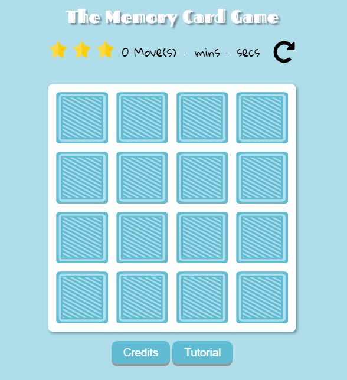
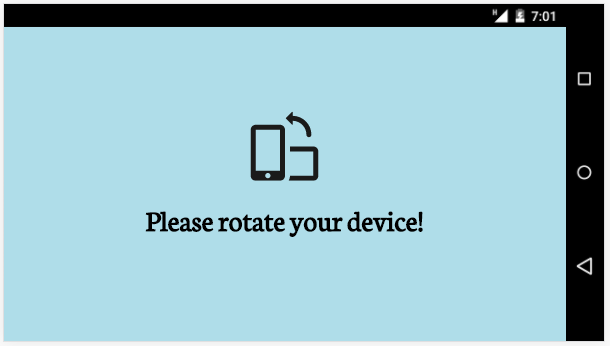

# Project: Memory Card Game

### Fend Nanodegree - Web Programming with Javascript Module

Create a Memory Card Game with 16 cards, a score panel showing player's rating, moves, time. At the end of the game a message will pop up to recap player's performance.
The player can restart the game anytime or play it again at the end.
### Brief introduction
The player is provided of 16 cards on the table(8 couples of 2 identic cards).
The goal of the game is to match all couples.

The timer starts when the first valid click is detected.

Every valid click on a card is counted as a move, basically a perfect game needs 16 moves. The player is rated accorging to moves needed to win the game, 3 stars need less than 28 moves, 2 stars need between 29 and 32 moves, 1 star more than 33 moves.
Since Udacity project rubric indicates 1 star as lower rating there is no rating less than 1 star.

Once a couple is correctly matched it disappears from the table, if the player wins tha game all the cards are shown on the table.

Playing the game in landscape orientation on mobile is prevented by showing an alert to rotate the device.

I choose this option instead to resize the app because in landscape mode there are basically these options:
* do not resize the app and force player to continuosly scroll it to play;
* to resize the app to fit the table but hiding the score panel and other contents;
* resize the app to include everything but resulting too tiny to read;
* prevent the player to play in  landscape orientation;

I think the last option more elegant and my furhter practice on a new feature.

### New skills applied from the Module:
* Javascript
### Required:
All application components are usable across modern desktop, tablet, and phone browsers.
### Additional features:
* There are 23 different cards.
 The array is shuffled a first time, then it is used the .slice() method to extract 8 of them.
 Finally it is used the .concat() method to double the array and it is shuffled again.
* Custom pointer
* Landscape device rotation not allowed

### Credits:
Pets, favicon and pointer designs made by [Freepik](http://www.freepik.com/) from [www.flaticon.com](https://www.flaticon.com/) distributed under the [free license](https://file000.flaticon.com/downloads/license/license.pdf) with attribution. This means once I attribute them to the author **I am allowed to use and alter the contents**.
_Alterations made by me_ in this projects concern:
* modifications to size and color to make the pointer;
* modifications to size and color to make the favicon;
* modifications to pets' size to put them on a card;
* modifications to pets, added missing leg to the chicken, fixed some eyes, elephant from sad to happy.

### Special thanks:
Many many thanks to [Tania Rascia](https://github.com/taniarascia). Check out her [awesome tutorials](https://www.taniarascia.com/).

This app borns from her tutorial "[How to Create a Memory Game (ala Super Mario 3) with Plain JavaScript](https://www.taniarascia.com/how-to-create-a-memory-game-super-mario-with-plain-javascript/)" where she explains step by step how to create a basic memory card game with n cards.
I expanded it to fit Udacity requirements as the score panel (player's rating, moves counter, timer, restart button), the message to pop up when the game ends with the game's recap, the play again button and design/features I wanted to create above already mentioned.

### License:
**No License**
_**Meaning**: Unless you include a license that specifies otherwise, nobody else can use, copy, distribute, or modify your work without being at risk of take-downs, shake-downs, or litigation._
