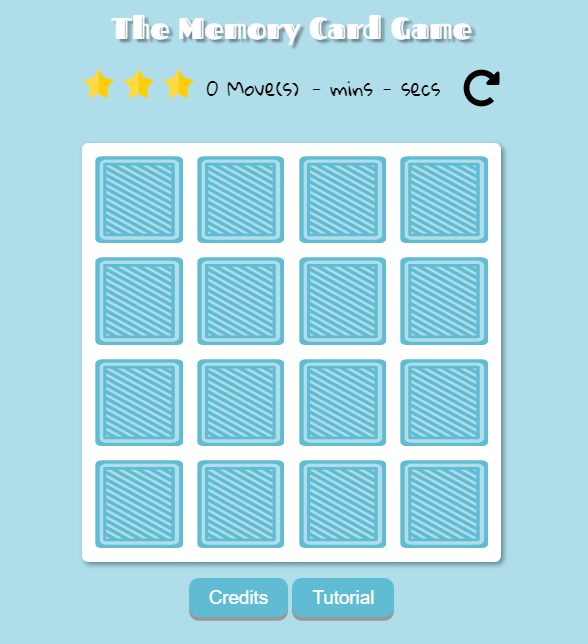

# Project: Memory Card Game

### Fend Nanodegree - Web Programming with Javascript Module

Create a Memory Card Game with 16 cards, a score panel showing player's rating, moves, time. At the end of the game a message will pop up to recap player's performance.
The player can restart the game anytime or play it again at the end.

### New skills applied from the Module:
* Javascript;
### Required:
All application components are usable across modern desktop, tablet, and phone browsers.
### Additional features:
* There are 23 different cards.
* The array is shuffled a first time, then it is used the .slice() method to extract 8 of them.
* Finally it is used the .concat() method to double the array and it is shuffled again.

### Credits:
Pets, favicon and pointer designs made by [Freepik](http://www.freepik.com/) from [www.flaticon.com](https://www.flaticon.com/) distributed under the [free license](https://file000.flaticon.com/downloads/license/license.pdf) with attribution. This means once I attribute them to the author **I am allowed to use and alter the contents**.
_Alterations made by me_ in this projects concern:
* modifications to size and color to make the pointer;
* modifications to size and color to make the favicon;
* modifications to pets' size to put them on a card;
* modifications to pets, added missing leg to the chicken, fixed some eyes.

### Special thanks:
Many many thanks to [Tania Rascia](https://github.com/taniarascia). Check out her [awesome tutorials](https://www.taniarascia.com/).

This app is based on her tutorial "[How to Create a Memory Game (ala Super Mario 3) with Plain JavaScript](https://www.taniarascia.com/how-to-create-a-memory-game-super-mario-with-plain-javascript/)" expanded to fit Udacity requirements and design/features I wanted to create.

### License:
**No License**
_**Meaning**: Unless you include a license that specifies otherwise, nobody else can use, copy, distribute, or modify your work without being at risk of take-downs, shake-downs, or litigation._
